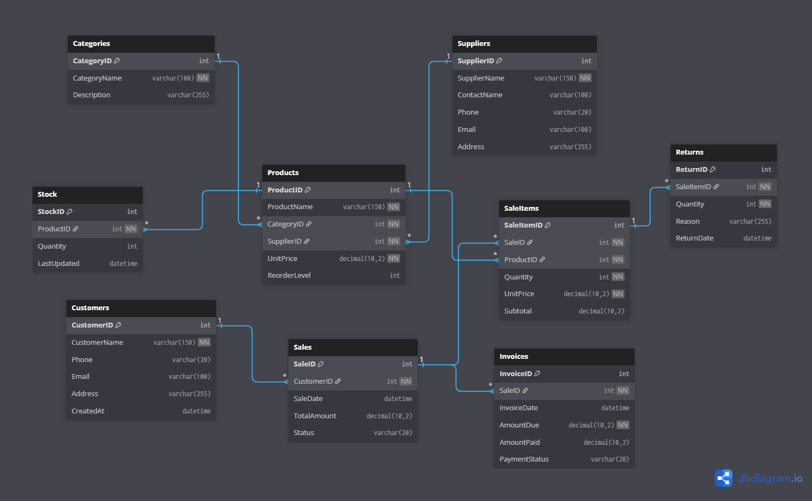

# Inventory & Sales Management System

A fully functional SQL Server database system for managing product inventory, 
sales transactions, customer records, and invoicing.

## ERD Diagram

## Database Schema
The system is built with 9 tables:

| Table | Description |
|-------|-------------|
| Categories | Product groupings |
| Suppliers | Who supplies products |
| Products | Items available for sale |
| Stock | Current quantity per product |
| Customers | Who buys |
| Sales | Receipt header per transaction |
| SaleItems | Individual items on each sale |
| Invoices | Generated per sale |
| Returns | Returned sale items |

## Features
- Auto stock update via triggers when a sale or return occurs
- Computed subtotal on SaleItems
- Stored procedures for making sales and processing returns
- Views for sales reports and low stock alerts
- Functions for customer total purchases and stock checks

## Tech Stack
- Microsoft SQL Server
- SSMS (SQL Server Management Studio)

## How to Run
1. Open SSMS and connect to your server
2. Run `schema.sql` first
3. Run `seed.sql` to populate sample data
4. Run `triggers.sql`, `procedures.sql`, `views.sql`, `functions.sql` in order

## Author
Built by Reuben Korsi Amuzu